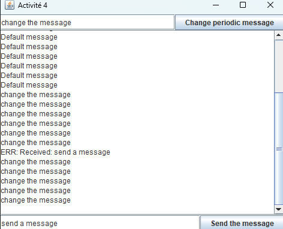
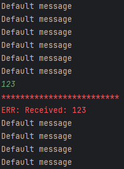
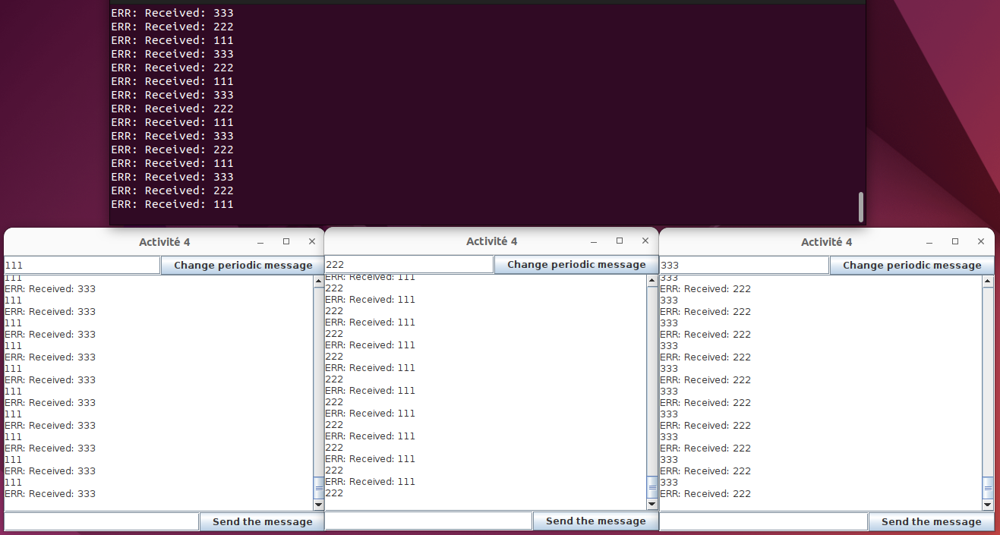

## Introduction
Le but de cette activité est de faire le lien entre l'écriture des algorithmes et leur programmation.

Travail demandé : réaliser un programme dans le langage de votre choix tel que :

1. Le programme écrit un message périodiquement sur la sortie standard. 
   - Le message est simplement une chaîne de caractères.
   - Si le programme inclut une interface graphique, le message pourrait être modifiable en cours d'exécution. Sinon son contenu peut être fixé au lancement du programme.
   - Il n'y a pas d'autres affichages sur la sortie standard. Utiliser la sortie erreur standard pour tout autre affichage.
2. Le programme est capable de réceptionner une chaîne de caractères sur son entrée standard.
   - Si le programme inclut une interface graphique, alors celle-ci pourrait l'afficher.
   - Sinon le message reçu peut être affiché sur la sortie erreur standard, par exemple sous la forme "réception de xxx".
3. Propriétés :
   - Le programme est séquentiel (une seule action à la fois).
   - Les actions d'émission et de réception sont atomiques (une fois commencées, elles ne sont pas interrompues).
   - Dans la mesure du possible, la réception est asynchrone : le programme ne vérifie pas périodiquement son entrée ; il lit l'entrée standard lorsqu'il y a quelque chose à lire.
4. Vérification (cf. TD) :
   - Pour vérifier les communications, construire un réseau simple avec le shell :
      - Un lien entre deux sites : ./prog | ./prog
      - Un anneau : mkfifo /tmp/f ; ./prog < /tmp/f | ./prog | ./prog > /tmp/f
      - NB : d'autres exemples de réseaux en shell seront développés dans le tutoriel Airplug, dans le cadre du projet de programmation.
   - Pour vérifier l'atomicité, ajouter une boucle dans les actions de réception ou d'émission afin d'augmenter artificiellement leur durée :
      - répéter un grand nombre de fois
      - écrire sur stderr "."
      - attendre 10 secondes

## Principe de solution
## Swing GUI réalisé par la classe JFrame
   - Le text-box  supérieure est utilisée pour modifier les informations envoyées périodiquement.
   - Le text-box  inférieure est utilisée pour envoyer des informations uniques.
   
## Ecrire un message périodiquement
   - Il y a un horloge qui écrire un message sur GUI et STDOUT par seconde.
   ```java 
        Timer timer = new Timer(1000, e -> {
            outputArea.append(periodicMessage + "\n");
            setScrollBarBottom(scrollPane);
            System.out.println(periodicMessage);
        });
        timer.start();
   ```
    
   - Le message peut être modifié une fois le button est cliqué.
   ``` java
    changeButton.addActionListener(e -> {
        changeButton.setEnabled(false);
        periodicMessage = inputField.getText().isEmpty() ? periodicMessage : inputField.getText();
        changeButton.setEnabled(true);
    });
   ```

## Réceptionner une chaîne de caractères
   - Le programme peut réceptionner une chaîne de caractères depuis **STDIN** dans un nouveau Thread, et **l'écrit sur STDERR et GUI**.
   ``` java
    Thread inputListenerThread = new Thread(() -> {
        BufferedReader reader = new BufferedReader(new InputStreamReader(System.in));
        String line;
        try {
            while ((line = reader.readLine()) != null) {
                timer.stop();
                System.err.println("ERR: Received: " + line);
                outputArea.append("ERR: Received: " + line + "\n");
                setScrollBarBottom(scrollPane);
                timer.start();
            }
        } catch (IOException err) {
            System.out.println("Exception : " + err.getMessage());
        }
    });
    inputListenerThread.start();
   ```

   - Bonus: L'utilisateur peut envoyer un message depuis GUI, et ce message va afficher sur **STDERR et GUI**.
   ``` java
    receptionButton.addActionListener(e -> new Thread(() -> {   //开了新线程，对于主线程的话按钮这个动作就是一瞬间完成的所以gui不会被阻塞，而在子线程进行append
        receptionButton.setEnabled(false);
        timer.stop();
        String receivedMessage = receptionField.getText();
        System.err.println("ERR: Received: " + receivedMessage);
        outputArea.append("ERR: Received: " + receivedMessage + "\n");
        setScrollBarBottom(scrollPane);
        timer.start();
        receptionButton.setEnabled(true);
    }).start());
   ```
## Propriétés
1. **Séquentiel**: même si le programme est multi-Threads, ils ne s'influencent pas, l'action d'un Thread ne dépend pas d'autre. Donc le programme est séquentiel.

2. **Atomique**: Quand le programme envoie ou reçoit un message, l'écriture du message de périod va arrêter temporairement afin que l'action ne soit pas interrompue, ce qui vérifie l'atomicité.
      - Pour vérifier, on peut augmenter artificiellement la durée de réception par exemple:
      ``` java
     Thread inputListenerThread = new Thread(() -> {
          BufferedReader reader = new BufferedReader(new InputStreamReader(System.in));
          String line;
          try {
              while ((line = reader.readLine()) != null) {
                  timer.stop();
                  //atomic
                  for (int i = 0; i < 25; i++) {
                      outputArea.append("*");
                      setScrollBarBottom(scrollPane);
                      System.err.print("*");
                      try {
                          Thread.sleep(200);
                      } catch (InterruptedException err) {
                          System.out.println("Exception in atomicity: " + err.getMessage());
                      }
                  }
                  System.err.print("\n");
                  outputArea.append("\n");
                  //atomic
                  System.err.println("ERR: Received: " + line);
                  outputArea.append("ERR: Received: " + line + "\n");
                  setScrollBarBottom(scrollPane);
                  timer.start();
              }
          } catch (IOException err) {
              System.out.println("Exception : " + err.getMessage());
          }
      });
      inputListenerThread.start();
     ```
     - Voici l'affichahe, l'action de réception dure 5 seconde mais pas être interrompue: 
     - 
3. **Asynchrone**: le programme ne vérifie pas périodiquement son entrée, il se bloque jusqu'à il y a une chaîne de caractère à lire.

## Communication
   - Pour vérifier les communications, construire un réseau simple avec le shell :
       ``` shell
            cd existing_repo
            javac Activite4
            mkfifo /tmp/f
            java Activite4 < /tmp/f | java Activite4 | java Activite4 > /tmp/f
       ```
   - Voici l'affichahe, qui vérifie la communication entre 3 processus:
     